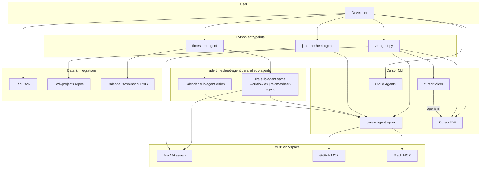

# zb-orchestrator

**Personal automation layer around Cursor, Jira, and Google Calendar**

*Internal demo / overview — structure, tools, impact, and demo ideas*

---

## 1. Elevator pitch

**zb-orchestrator** is a small Python toolkit that:

- **Navigates** a fixed tree of local repos (`~/zb-projects`) and **opens the right workspace in Cursor** with a **seeded Agent prompt** (optionally tied to a **Jira ticket**).
- **Produces timesheets** by combining **Jira data** (via Cursor Agent + **Atlassian MCP**) and/or **calendar events extracted from a screenshot** (vision via Cursor Agent).
- **Encodes team workflow** in **Cursor Skills** and **Rules** so every Agent session follows the same branch/commit conventions.

It is not a hosted SaaS: it runs **on your machine**, driven by the **Cursor CLI** (`cursor`, `cursor agent`, Cursor IDE, Cloud Agents).

---

## 2. Why this exists (problem → outcome)

| Pain | What this repo does |
|------|---------------------|
| Many repos under one tree; picking the right one is friction | **zb-agent** lists / fuzzy-matches projects and opens **one folder or a multi-root `.code-workspace`** |
| Agent sessions start “cold” without ticket or workflow context | **Seed prompts** inject **Intent**, optional **Jira key**, and **skill names** (branch/commit/timesheet) |
| Weekly reporting mixes Jira tickets and calendar meetings | **timesheet-agent** runs **Jira MCP** and **calendar vision** **in parallel**, then prints labeled blocks |
| Repetitive git/Jira ceremony | **Cursor Skills** (`init-local-ticket-branch`, `commit-it-then`, `generate-timesheet`) + **Rules** |

---

## 3. Repository map (what lives where)

```
zb-orchestrator/
├── zb-agent.py              # Project navigator → Cursor / shell / rebase helper
├── zb_orchestrator_launch.py # Shared: resolve workspace, timesheet prompt, open_in_cursor
├── cursor_agent_runner.py   # Subprocess: cursor agent --print (headless agent)
├── timesheet-agent          # CLI: calendar screenshot + optional Jira (parallel agents)
├── jira-timesheet-agent     # Opens IDE with Jira timesheet seed (interactive)
├── timesheet_ui/            # Flask UI: upload screenshot → runs timesheet-agent
├── format_calendar_meetings.py  # Deterministic formatting after vision JSON
├── .cursor/skills/          # generate-timesheet, init-local-ticket-branch, …
├── .cursor/rules/           # zb-agent workflow, plan mode defaults
├── scripts/                 # git-rebase-origin-main.sh, cleanup-zb-agent-docker.sh
└── .github/workflows/       # Optional Docker cleanup for agent runners
```

---

## 4. Architecture (conceptual)



**Headless path:** `timesheet-agent` runs **two** `cursor agent --print` tasks in parallel. The **Jira leg** uses the **same** generate-timesheet prompt/skill as **`jira-timesheet-agent`** (sub-agent logically; implemented as `run_jira_timesheet_via_cursor_agent`, not a subprocess). The **calendar leg** reads the screenshot. Stdout is split into `[JIRA_AGENT_OUTPUT]` and `[TIMESHEET-OUTPUT]`.

---

## 5. Tooling stack

| Layer | Technologies |
|-------|----------------|
| Language | **Python 3** |
| Editor automation | **Cursor** (Cursor IDE, `cursor`, `cursor agent`, `--print`, `--approve-mcps`, `--trust`; Cloud Agents) |
| Jira | **Atlassian MCP** in Cursor (queries assigned issues, JQL, etc.) |
| Optional LLM routing | **OpenAI** or **Ollama** (OpenAI-compatible API) for `--reason` in zb-agent |
| Vision | **Cursor Agent** reads cached screenshot path under workspace |
| Web UI | **Flask**, localhost only |
| CI | **GitHub Actions** — workflow_dispatch cleanup for **zb-agent** Docker containers |

---

## 6. Feature A — **zb-agent** (project orchestration)

**Behavior:**

- Discovers projects under **`~/zb-projects`** (not tied to where the script lives).
- Resolves user intent by **fuzzy name match** or optional **`--reason`** (LLM picks `category/name` IDs from a catalog JSON).
- **`--ticket ECOMM-1234`** (or `ZB_AGENT_TICKET`) injects **Jira workflow** into the seed.
- **`--ide-only`** — folder only, no Agent prompt.
- **`--cli-only`** — shell (or tmux panes for multiple repos).
- **`--rebase-main`** — stash, fetch, rebase onto `origin/main` via script.
- **`--install`** — symlink `zb-agent` → `~/.local/bin`.

**Multi-repo:** writes `~/.zb-workspaces/<names>.code-workspace`; Agent workspace uses **first project** (CLI limitation called out in code).

### Snippet — seed prompt (ticket vs no ticket)

```615:638:zb-agent.py
def build_cursor_agent_prompt(
    *,
    intent: str,
    ticket: str | None = None,
    reasoning: str | None = None,
) -> str:
    lines: list[str] = []
    if ticket:
        lines.append(f"Work on Jira ticket {ticket}.")
    lines.append(f"Intent: {intent}")
    if reasoning and reasoning.strip():
        lines.append(f"Planning notes: {reasoning.strip()}")
    if ticket:
        lines.append(
            "Workflow: use Cursor skills when relevant — init-local-ticket-branch "
            "(branch from main, push, Jira In Progress if applicable) and "
            "commit-it-then (conventional commits with this ticket in brackets)."
        )
    else:
        lines.append(
            "Workflow: use Cursor skills when relevant. If this work maps to a Jira ticket, "
            "use init-local-ticket-branch and commit-it-then with the ticket in brackets; "
            "otherwise use commit-it-then with [NOTICKET] when committing."
        )
    return "\n".join(lines)
```

---

## 7. Feature B — **timesheet-agent** (Jira + calendar in one run)

**Default:** two **parallel** `cursor agent --print` runs:

1. **Jira leg** — same prompt chain as `jira-timesheet-agent` (`build_timesheet_prompt` + **MCP**).
2. **Calendar leg** — screenshot copied into **`.calendar_vision_cache/`**, Agent returns **strict JSON** of events; Python normalizes and formats.

**Output markers** (easy to parse or show in UI):

```
[JIRA_AGENT_OUTPUT]
…text from Jira skill…

[TIMESHEET-OUTPUT]
…calendar markdown or JSON…
```

**Flags:** `--no-jira` (calendar only), `--capture` (macOS `screencapture`), `--image`, `--json`, `--with-times`.

### Snippet — parallel execution

```551:569:timesheet-agent
        if with_jira:
            print(
                "Running calendar vision + Jira timesheet in parallel (two Cursor Agent runs)…",
                file=sys.stderr,
            )
            with ThreadPoolExecutor(max_workers=2) as pool:
                jira_f = pool.submit(
                    run_jira_timesheet_via_cursor_agent,
                    workspace=ws,
                    intent=jira_intent,
                )
                cal_f = pool.submit(
                    run_calendar_via_cursor_agent,
                    image_path=image_path,
                    workspace=ws,
                )
                jira_text = jira_f.result()
                parsed = cal_f.result()
```

### Snippet — headless Cursor Agent helper

```20:79:cursor_agent_runner.py
def run_cursor_agent_task(
    prompt: str,
    *,
    workspace: Path | None = None,
    timeout: float = 600.0,
    output_format: str = "text",
    model: str | None = 'auto',
    approve_mcps: bool = False,
) -> str:
    """
    Execute: cursor agent --workspace <dir> --print --output-format <fmt> [ --model <m> ] <prompt>
    ...
    **MCP:** pass ``approve_mcps=True`` for workflows that need Jira/other MCP tools
    (equivalent to interactive ``cursor agent --approve-mcps``).
    """
    cursor = find_cursor_cli()
    ...
    cmd: list[str] = [
        cursor,
        "agent",
        "--workspace",
        str(ws),
        "--print",
        "--trust",
        "--output-format",
        output_format,
    ]
    if approve_mcps:
        cmd.append("--approve-mcps")
```

---

## 8. Feature C — **Jira timesheet** via Skills (interactive)

**`jira-timesheet-agent`** resolves the orchestrator folder (must contain **`.cursor/skills/generate-timesheet/SKILL.md`**), builds the same prompt as headless mode, and runs **`cursor agent --approve-mcps`** so MCP tools work without repeated approval.

### Snippet — skill mandates real tool execution

```10:21:.cursor/skills/generate-timesheet/SKILL.md
## Execution rules (mandatory)

**Do not** stop after reading this file. **Do not** reply with only a narrative summary of the workflow, a list of “what I would do,” generic JQL examples, or “MCP may not be available” **before** you have attempted the steps below with the tools you have.

**Do** run the workflow **step by step**, in order:

1. **Invoke** `getAccessibleAtlassianResources` and use its result to set **cloudId** (see §1 below).
2. **Invoke** `atlassianUserInfo` and use **accountId** for assignee (see §1).
3. **Build JQL** from those results and the user’s date/project intent (see §2).
4. **Invoke** `searchJiraIssuesUsingJql` with that **cloudId**, **jql**, and **fields** (see §3).
5. **Format** issues from the API response (see §4–5). Emit the timesheet **only after** you have issue rows (or a confirmed empty result from the search).
```

---

## 9. Feature D — **timesheet-ui** (small demo surface)

- **Flask** app on **127.0.0.1** only (no auth — explicitly local).
- Upload a screenshot; background thread runs **`timesheet-agent`** with same flags as CLI.
- Splits **`[JIRA_AGENT_OUTPUT]`** / **`[TIMESHEET-OUTPUT]`** for display.

Good for a **live demo**: drag a calendar PNG, show side-by-side Jira summary + formatted meetings.

---

## 10. Governance — Cursor **Rules** + **Skills**

| Artifact | Purpose |
|----------|---------|
| `.cursor/rules/zb-agent-workflow.mdc` | When in ticket flow: **init-local-ticket-branch** + **commit-it-then**; timesheet flow: **generate-timesheet** only (no stray branches) |
| `.cursor/rules/agent-plan-mode-default.mdc` | Default **plan-first** behavior for agents in this project |
| `.cursor/skills/init-local-ticket-branch` | Branch from `main`, push, Jira transition |
| `.cursor/skills/commit-it-then` | Conventional commits, 50-char subject, ticket in brackets |
| `.cursor/skills/generate-timesheet` | Jira query + format |
| `.cursor/skills/clean-up-current-branch` | Stash, checkout main, delete branch |
| `.cursor/skills/open-github-pr` | PR workflow via MCP |

This turns “how we work” into **repeatable Agent behavior**.

---

## 11. Automation & CI

- **`scripts/cleanup-zb-agent-docker.sh`** + **`.github/workflows/cleanup-zb-agent-docker.yml`** — manual workflow_dispatch to clean **zb-agent**-labeled Docker containers on a runner (useful for **self-hosted** agent workloads).
- **`scripts/git-rebase-origin-main.sh`** — used by **`zb-agent --rebase-main`**.

---

## 12. Impact (what changes for you)

1. **Faster context switching** — one command from intent → correct repo + seeded Agent.
2. **Less copy-paste** — Jira timesheet steps are **skill-driven** and **verified** (cloudId → user → JQL → search).
3. **Richer weekly reports** — **Jira assignments** and **calendar reality** in **one** CLI run (or UI upload).
4. **Consistent git hygiene** — ticket branches and commit messages **without** memorizing conventions.
5. **Extensible** — new Skills/Rules or a new script calling `run_cursor_agent_task()` follow the same pattern.

---

## 13. Possibilities unlocked (next steps)

| Idea | How this repo supports it |
|------|---------------------------|
| **Slack / email digest** | Parse `[JIRA_AGENT_OUTPUT]` / `[TIMESHEET-OUTPUT]` and post to a webhook |
| **Scheduled runs** | Cron + `timesheet-agent --image weekly.png` (headless) |
| **Stronger calendar accuracy** | Iterate on **CALENDAR_JSON_RULES** or dedicated vision model via env |
| **More MCPs** | Same `cursor agent --approve-mcps` pattern; workspace `.cursor/mcp.json` |
| **Team rollout** | Share **Skills/Rules** + document **`~/zb-projects` layout** and **`CURSOR_AGENT_*` env** |

---

## 14. Demo script (5–10 minutes)

1. **zb-agent:** `./zb-agent.py --list` → pick a project → show Cursor opening with **Intent** line in Agent.
2. **Ticket flow:** `./zb-agent.py zenscripts --ticket ECOMM-XXXX --no-open` → paste seed showing **init-local-ticket-branch** / **commit-it-then**.
3. **timesheet:** `./timesheet-agent -i sample-calendar.png --no-jira` (faster) or full parallel run if MCP is configured.
4. **Optional:** `./timesheet-ui` (or `python -m timesheet_ui`) → upload PNG → show split Jira + calendar panels.
5. **Close:** show **`.cursor/skills/generate-timesheet/SKILL.md`** execution rules — “the agent must actually call tools.”

---

## 15. Closing line

**zb-orchestrator** treats Cursor as the **automation engine**: Python **orchestrates** *when* and *where* agents run; Skills and Rules define *how* they behave — giving you **repeatable**, **auditable** workflows from a **small**, **local** codebase.

---

*Generated from repository inspection. Adjust demo steps to match your MCP credentials and `~/zb-projects` contents.*
